# Dub Siren V2 - PCB HAT Schematic (Mermaid Diagrams)
## Hybrid Design: Panel-Mount Encoders + Edge Breakouts

## Board Architecture Overview

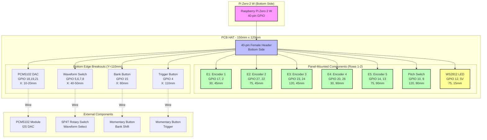

## PCB Physical Layout (Top View - 150mm × 120mm)

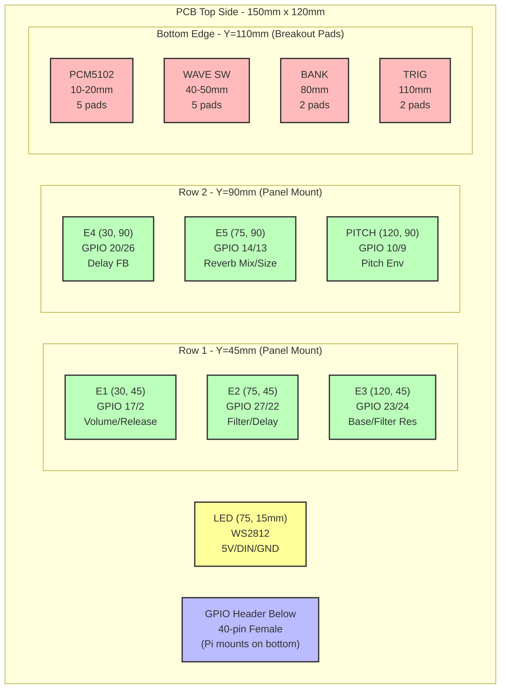

## Component Spacing Diagram

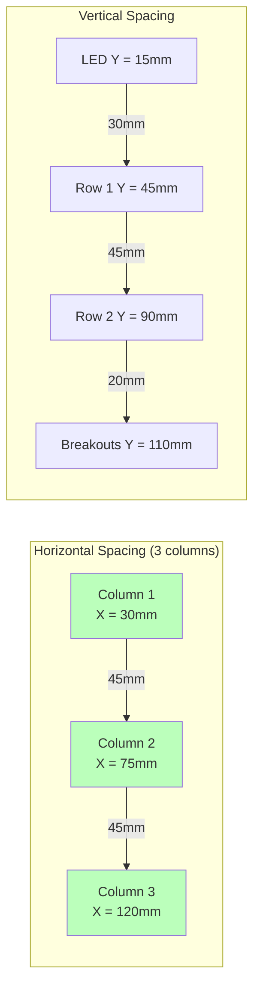

## GPIO Pin Routing Schematic

```mermaid
graph LR
    subgraph "Pi Zero GPIO Header"
        PIN3[Pin 3<br/>GPIO 2]
        PIN7[Pin 7<br/>GPIO 4]
        PIN8[Pin 8<br/>GPIO 14]
        PIN10[Pin 10<br/>GPIO 15]
        PIN11[Pin 11<br/>GPIO 17]
        PIN12[Pin 12<br/>GPIO 18]
        PIN13[Pin 13<br/>GPIO 27]
        PIN15[Pin 15<br/>GPIO 22]
        PIN16[Pin 16<br/>GPIO 23]
        PIN18[Pin 18<br/>GPIO 24]
        PIN19[Pin 19<br/>GPIO 10]
        PIN21[Pin 21<br/>GPIO 9]
        PIN24[Pin 24<br/>GPIO 8]
        PIN26[Pin 26<br/>GPIO 7]
        PIN29[Pin 29<br/>GPIO 5]
        PIN31[Pin 31<br/>GPIO 6]
        PIN32[Pin 32<br/>GPIO 12]
        PIN33[Pin 33<br/>GPIO 13]
        PIN35[Pin 35<br/>GPIO 19]
        PIN37[Pin 37<br/>GPIO 26]
        PIN38[Pin 38<br/>GPIO 20]
        PIN40[Pin 40<br/>GPIO 21]
        GND[GND Pins]
        V5[5V Pin 2/4]
        V33[3.3V Pin 1/17]
    end

    subgraph "Panel-Mounted Components"
        E1_CLK[E1_CLK]
        E1_DT[E1_DT]
        E2_CLK[E2_CLK]
        E2_DT[E2_DT]
        E3_CLK[E3_CLK]
        E3_DT[E3_DT]
        E4_CLK[E4_CLK]
        E4_DT[E4_DT]
        E5_CLK[E5_CLK]
        E5_DT[E5_DT]
        PITCH_U[PITCH_UP]
        PITCH_D[PITCH_DN]
        LED_D[LED_DIN]
    end

    subgraph "Edge Breakout Pads"
        DAC_LCK[DAC_LCK]
        DAC_BCK[DAC_BCK]
        DAC_DIN[DAC_DIN]
        WAVE1[WAVE_1]
        WAVE2[WAVE_2]
        WAVE3[WAVE_3]
        WAVE4[WAVE_4]
        BANK_B[BANK_BTN]
        TRIG_B[TRIG_BTN]
        DAC_V[DAC_3V3]
    end

    PIN11 --> E1_CLK
    PIN3 --> E1_DT
    PIN13 --> E2_CLK
    PIN15 --> E2_DT
    PIN16 --> E3_CLK
    PIN18 --> E3_DT
    PIN38 --> E4_CLK
    PIN37 --> E4_DT
    PIN8 --> E5_CLK
    PIN33 --> E5_DT
    PIN19 --> PITCH_U
    PIN21 --> PITCH_D
    PIN32 --> LED_D

    PIN12 --> DAC_LCK
    PIN35 --> DAC_BCK
    PIN40 --> DAC_DIN
    PIN29 --> WAVE1
    PIN31 --> WAVE2
    PIN26 --> WAVE3
    PIN24 --> WAVE4
    PIN10 --> BANK_B
    PIN7 --> TRIG_B

    V5 --> LED_D
    V33 --> DAC_V

    style E1_CLK fill:#bfb
    style E2_CLK fill:#bfb
    style E3_CLK fill:#bfb
    style E4_CLK fill:#bfb
    style E5_CLK fill:#bfb
    style PITCH_U fill:#bfb
    style DAC_LCK fill:#fbb
    style DAC_BCK fill:#fbb
    style DAC_DIN fill:#fbb
    style WAVE1 fill:#fbb
    style BANK_B fill:#fbb
    style TRIG_B fill:#fbb
```

## Electrical Connections: Panel-Mounted Encoder

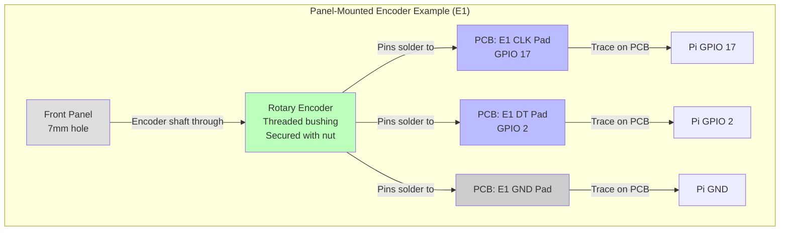

## Electrical Connections: Edge Breakout Pads

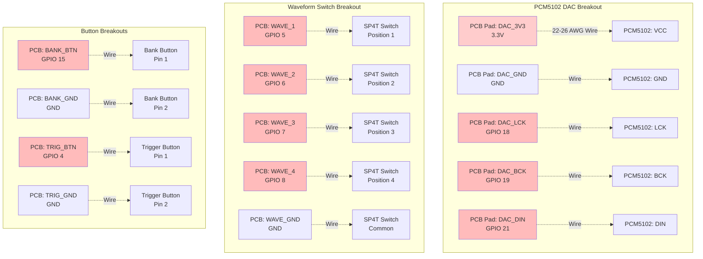

## Power Distribution

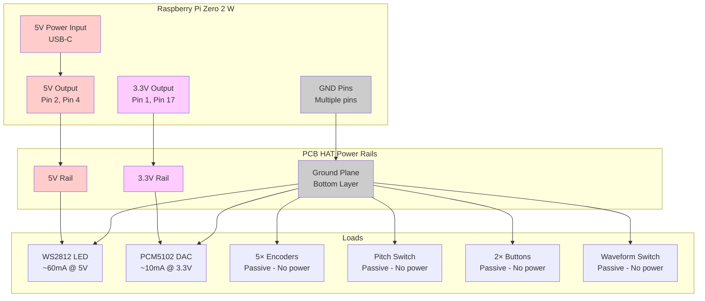

## PCB Assembly Cross-Section

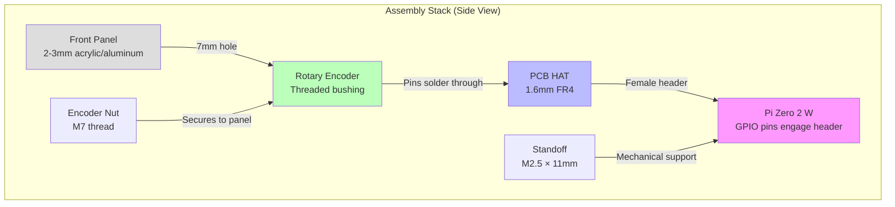

## I2S Reserved Pins Warning

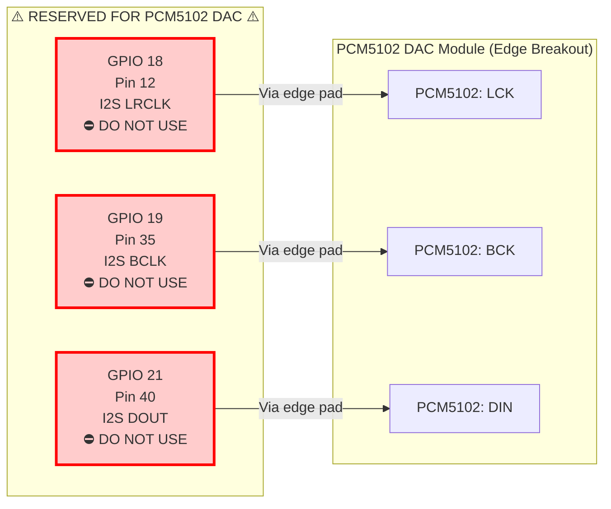

## Complete GPIO Allocation Map

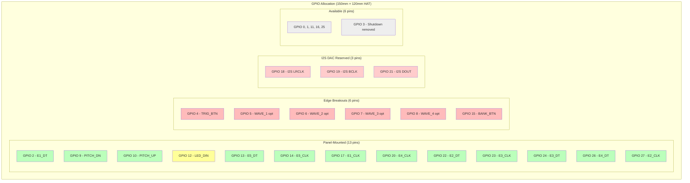

## Board Dimensions Summary

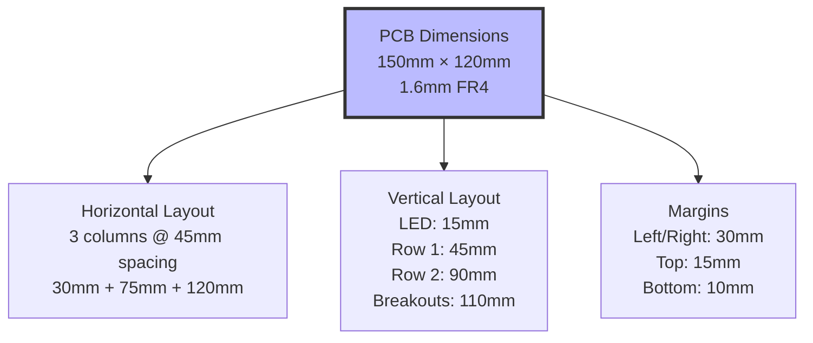

---

## Key Design Features

### Panel-Mounted Components (Green)
- **5 Rotary Encoders** at 45mm spacing
- **Pitch Toggle Switch** at 45mm spacing
- **LED** at top center
- All mount through PCB to front panel with threaded bushings

### Edge Breakouts (Red)
- **PCM5102 DAC** (5 pads) - I2S audio interface
- **Waveform Switch** (5 pads) - Optional SP4T rotary
- **Bank Button** (2 pads) - External momentary switch
- **Trigger Button** (2 pads) - External momentary switch

### Electrical Design
- All encoders/switches use **internal pull-up resistors** (active-low logic)
- No external resistors required on GPIO inputs
- WS2812 LED requires **5V power**, accepts 3.3V data
- PCM5102 DAC uses **3.3V power**
- I2S pins (18, 19, 21) dedicated to audio DAC

---

**Document Version:** 2.0
**Date:** 2026-01-27
**Project:** Dub Siren V2 - Raspberry Pi Zero HAT (Hybrid Design)
