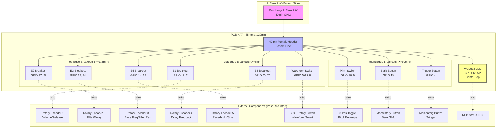
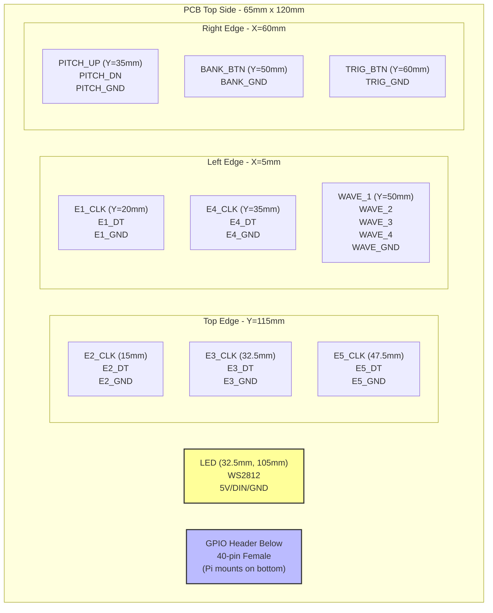
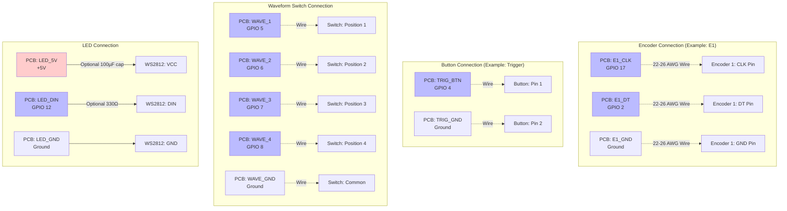
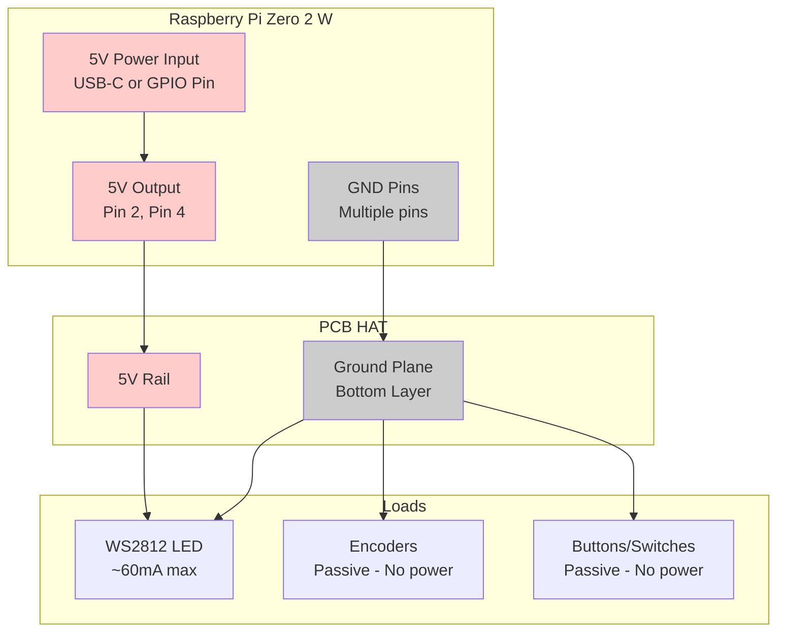
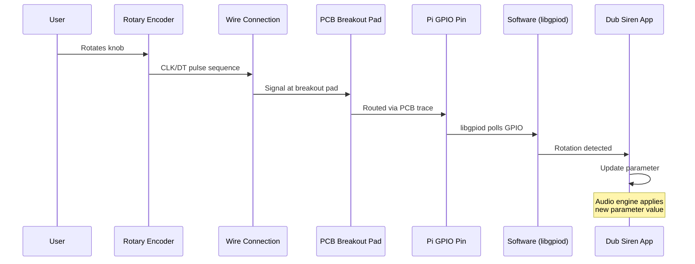
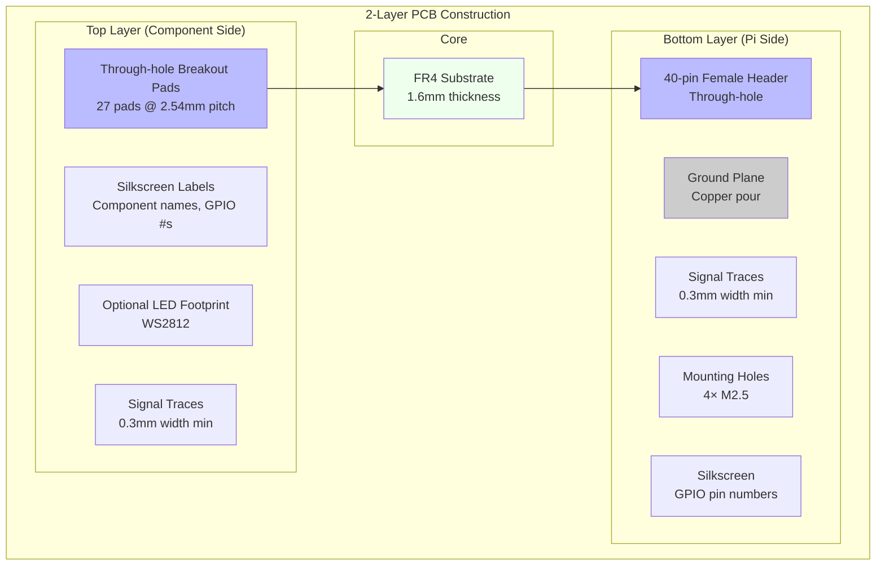
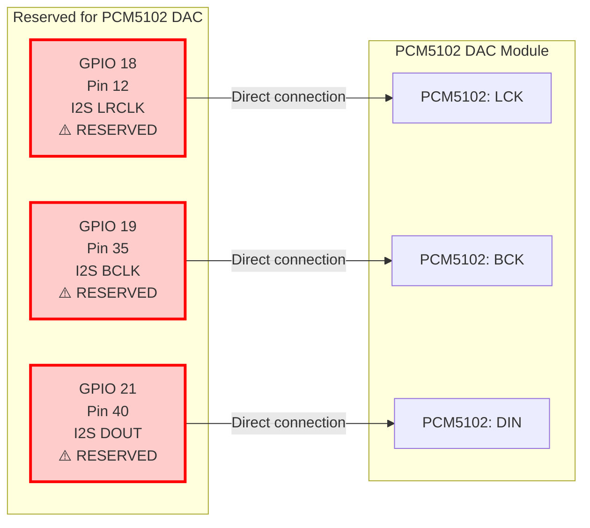
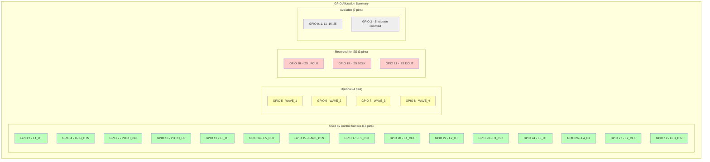

# Dub Siren V2 - PCB HAT Schematic (Mermaid Diagrams)

## Board Architecture Overview

## PCB Physical Layout (Top View)

## GPIO Pin Routing Schematic

```mermaid
graph LR
    subgraph "Pi Zero GPIO Header"
        PIN3[Pin 3<br/>GPIO 2]
        PIN7[Pin 7<br/>GPIO 4]
        PIN8[Pin 8<br/>GPIO 14]
        PIN10[Pin 10<br/>GPIO 15]
        PIN11[Pin 11<br/>GPIO 17]
        PIN13[Pin 13<br/>GPIO 27]
        PIN15[Pin 15<br/>GPIO 22]
        PIN16[Pin 16<br/>GPIO 23]
        PIN18[Pin 18<br/>GPIO 24]
        PIN19[Pin 19<br/>GPIO 10]
        PIN21[Pin 21<br/>GPIO 9]
        PIN24[Pin 24<br/>GPIO 8]
        PIN26[Pin 26<br/>GPIO 7]
        PIN29[Pin 29<br/>GPIO 5]
        PIN31[Pin 31<br/>GPIO 6]
        PIN32[Pin 32<br/>GPIO 12]
        PIN33[Pin 33<br/>GPIO 13]
        PIN37[Pin 37<br/>GPIO 26]
        PIN38[Pin 38<br/>GPIO 20]
        GND[GND Pins<br/>Multiple]
        V5[5V Pins<br/>2, 4]
    end

    subgraph "Edge Breakouts"
        E1_CLK[E1_CLK]
        E1_DT[E1_DT]
        E2_CLK[E2_CLK]
        E2_DT[E2_DT]
        E3_CLK[E3_CLK]
        E3_DT[E3_DT]
        E4_CLK[E4_CLK]
        E4_DT[E4_DT]
        E5_CLK[E5_CLK]
        E5_DT[E5_DT]
        WAVE1[WAVE_1]
        WAVE2[WAVE_2]
        WAVE3[WAVE_3]
        WAVE4[WAVE_4]
        PITCH_U[PITCH_UP]
        PITCH_D[PITCH_DN]
        BANK_B[BANK_BTN]
        TRIG_B[TRIG_BTN]
        LED_D[LED_DIN]
        LED_V[LED_5V]
        PAD_GND[GND Pads x15]
    end

    PIN11 --> E1_CLK
    PIN3 --> E1_DT
    PIN13 --> E2_CLK
    PIN15 --> E2_DT
    PIN16 --> E3_CLK
    PIN18 --> E3_DT
    PIN38 --> E4_CLK
    PIN37 --> E4_DT
    PIN8 --> E5_CLK
    PIN33 --> E5_DT
    PIN29 --> WAVE1
    PIN31 --> WAVE2
    PIN26 --> WAVE3
    PIN24 --> WAVE4
    PIN19 --> PITCH_U
    PIN21 --> PITCH_D
    PIN10 --> BANK_B
    PIN7 --> TRIG_B
    PIN32 --> LED_D
    V5 --> LED_V
    GND --> PAD_GND

    style GND fill:#ccc
    style V5 fill:#fcc
    style PAD_GND fill:#ccc
    style LED_V fill:#fcc
```

## Electrical Connections Detail

## Power Distribution

## Signal Flow: Encoder Example

## PCB Layer Stack

## I2S Audio Reserved Pins (Do Not Use)

## Complete GPIO Allocation Map

---

## Notes

- All encoders and buttons use **internal pull-up resistors** (configured in software)
- **Active-low logic:** Pressed/selected = LOW (0V), Released = HIGH (3.3V)
- No external resistors required on GPIO inputs
- WS2812 LED requires **5V power** but accepts 3.3V data signals
- PCB acts as simple breakout/routing board - all intelligence in Pi software
- External components mount to front panel, wire to PCB edge pads

---

**Document Version:** 1.0
**Date:** 2026-01-27
**Project:** Dub Siren V2 - Raspberry Pi Zero HAT
